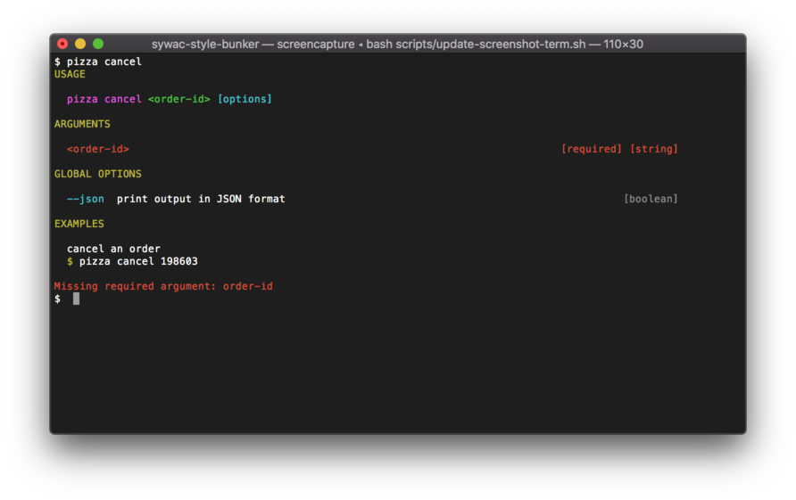

# sywac-style-chunky

> A chunky style for your [sywac](https://sywac.io/) CLI application.

This style is inspired by [sywac-style-basic](https://github.com/sywac/sywac-style-basic), except that
headers are yellow and forced uppercase, and the usage text is pushed to the next line, giving the
appearance of chunky headers for each section.



## Install

```console
$ npm install sywac
$ npm install sywac-style-chunky
```

## Usage

```js
const sywac = require('sywac');
const chunky = require('sywac-style-chunky');

sywac.style(chunky);
```

> *NOTE* This style renders group headers without trailing colons and in uppercase, but
> the underlying group names aren't changed - keep this in mind if you use `.groupOrder`,
> for example.

```js
sywac
  .number('port', { group: 'Server Options:' })
  .groupOrder(['Arguments:', 'Options:', 'Server Options:'])
  .style(chunky);

// ARGUMENTS
//   ...
//
// OPTIONS
//   ...
//
// SERVER OPTIONS
//   ...
```

